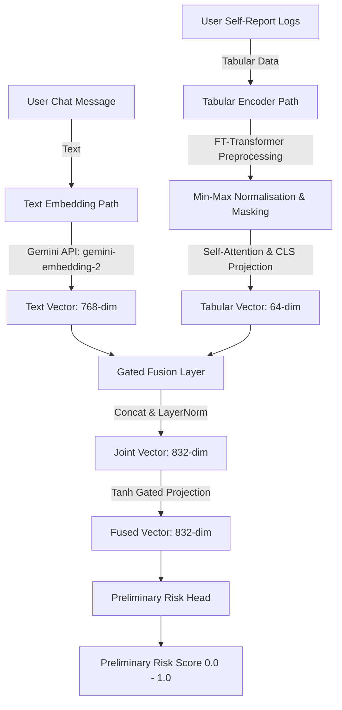

# Augur — Layer 1: Sensory & Early Fusion (Project Documentation)

---

## 1. Executive Summary (Project Manager Perspective)

### Goal & Scope
The primary objective of **Layer 1 (Sensory & Early Fusion)** is to serve as the unified multimodal entry point for the Kenko mental health support ecosystem. It ingests unstructured text input (user chat messages) and structured self-report metrics (sleep hours, mood, social engagement, etc.) and fuses them into a single, high-dimensional representation.

### Achievements & Value Delivered
*   **Dual-Path Modality Processing:** Replaces simple text analysis with a system that contextualizes conversations using recent behavioral logs.
*   **Rapid Risk Reflex:** Computes a preliminary risk score in **~580ms**, allowing safety systems to respond before invoking heavier downstream LLMs.
*   **Production Readiness:** Fully decoupled service structure with mock support, automated unit tests, and remote integration pipelines.

---

## 2. Technical System Architecture

### Component Details
1.  **Text Embedding Path ([embedding_service.py](file:///c:/Users/DELL/Desktop/mental%20health/Input%20Layer/layer1/embedding_service.py)):** Utilizes Google's modern `gemini-embedding-2` model to map chat text to a $768$-dimensional semantic space.
2.  **Tabular Encoder Path ([tabular_encoder.py](file:///c:/Users/DELL/Desktop/mental%20health/Input%20Layer/layer1/tabular_encoder.py)):** Runs a local **FT-Transformer** (Feature Tokenizer Transformer). It min-max normalizes user logs, handles missing data points gracefully using learned `mask_tokens`, and outputs a $64$-dimensional behavioral summary vector.
3.  **Gated Fusion Layer ([fusion.py](file:///c:/Users/DELL/Desktop/mental%20health/Input%20Layer/layer1/fusion.py)):** Concatenates both vectors into an $832$-dimensional array. It applies a learned Tanh-activated gating mechanism to dynamically weight the importance of logs vs. chat text based on log completeness.
4.  **Preliminary Risk Head ([fusion.py](file:///c:/Users/DELL/Desktop/mental%20health/Input%20Layer/layer1/fusion.py#L58)):** A multi-layer perceptron (MLP) with Sigmoid activation that calculates an early-warning risk scalar in $[0.0, 1.0]$.

---

## 3. Key Engineering Interventions

During the development and testing cycle, the following critical issues were diagnosed and resolved:

### 3.1. PyTorch DLL Access Violation (`WinError 1114`)
*   **Diagnostic:** PyTorch `2.12.1` crashed on import with `WinError 1114` inside the `c10.dll` library. This was caused by library path collision with the active Conda base environment on Windows.
*   **Resolution:** Downgraded the PyTorch dependency in the virtual environment to **`torch-2.6.0+cpu`** (leveraging the CPU index wheel). This version resolves standard Windows DLL lookup routes stably.

### 3.2. Missing Package Dependency
*   **Diagnostic:** The codebase imported `numpy` inside the FT-Transformer and embedding services, but it was missing from the repository's `requirements.txt`.
*   **Resolution:** Installed `numpy` in the virtual environment and locked it as **`numpy~=2.4.6`** in [requirements.txt](file:///c:/Users/DELL/Desktop/mental%20health/Input%20Layer/requirements.txt#L13).

### 3.3. Gemini Embedding Model Deprecation
*   **Diagnostic:** The original codebase called `models/text-embedding-004`, which was officially deprecated and shut down by Google on **January 14, 2026**, resulting in `404 NOT_FOUND` errors.
*   **Resolution:** Upgraded the configuration in `embedding_service.py` to target **`gemini-embedding-2`** (supporting Matryoshka output scaling down to $768$ dimensions).

### 3.4. Terminal Encoding & Localhost Loopback Failures
*   **Diagnostic:** The test script crashed on Windows CMD/PowerShell because of special character prints (`charmap` codec error). Additionally, it failed to connect to `localhost:8000` because Windows resolved `localhost` to IPv6 (`::1`), which Uvicorn does not bind to by default.
*   **Resolution:** 
    *   Cleaned output prints in `test_api.py` to use standard ASCII.
    *   Updated the test loopback address to `127.0.0.1`.

### 3.5. Git History Cleanup & Repository Push
*   **Diagnostic:** Hardcoded API credentials committed in the scratch files `listmodels.py` and `test1.py` triggered GitHub's **Push Protection (GH013)**, blocking remote pushes.
*   **Resolution:** Cleared the hardcoded keys, untracked them in Git, reset the branch pointer back to the remote baseline using `git reset origin/main`, and made a single clean commit to push successfully to [GitHub (sidkhatod/Augur)](https://github.com/sidkhatod/Augur).

---

## 4. Test Suite & Integration Results

### Unit Tests
The test suite in [test_layer1.py](file:///c:/Users/DELL/Desktop/mental%20health/Input%20Layer/tests/test_layer1.py) mocks API calls to ensure stable local testing without key dependencies. All **9 unit tests pass successfully**.

### End-to-End Integration Suite
The test pipeline [test_api.py](file:///c:/Users/DELL/Desktop/mental%20health/Input%20Layer/test_api.py) runs four profiles against the live API server:

1.  **Standard Case:** Normal chat and complete logs. Low-to-moderate risk returned.
2.  **High Risk Case:** Explicitly depressed chat combined with poor sleep/social logs. Triggers the safety reflex alert (`Risk Score > 0.7`).
3.  **Missing Features Case:** Partial sleep and mood logs. Imputes the missing fields via learned mask tokens.
4.  **New User Case:** Empty logs. Falls back gracefully to global mean priors.

---

## 5. Phase 2 & Production Roadmap

1.  **Supervised Training:** Replace random initialization weights in `TabularEncoder` and `FusionLayer` by training on clinical or synthesized datasets.
2.  **Temporal Sequences:** Upgrade `TabularEncoder` to process historical 7-day log trends (using architectures like PatchTST) instead of just single-day snapshots.
3.  **Downstream Integrations:** Wire the output `FusedVector` directly into:
    *   **Layer 3 (Llama Guard):** Using the preliminary risk score as a priority filter.
    *   **Layer 2 (Dialogue LLM):** Using the fused vector for context-aware dialog generation.
